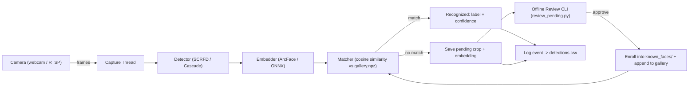
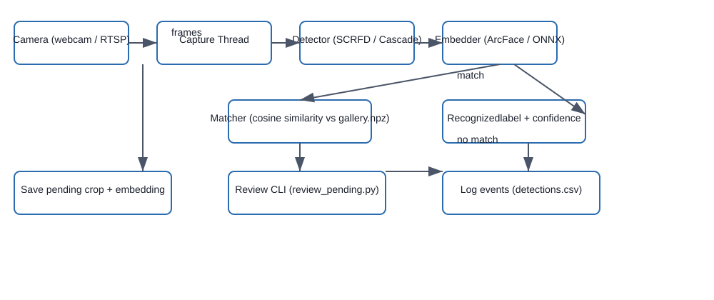

# Multi-Camera Face Detection and Recognition

**summary**

Multi-Camera Face Detection and Recognition — a lightweight real-time system that detects faces from multiple camera sources and recognizes enrolled identities, saving unknowns for offline review.

**Overview**

This repository implements a multi-threaded face detection and recognition pipeline using InsightFace/ArcFace embeddings and OpenCV. It targets developers and researchers who need a self-hosted, extensible solution for labeling and reviewing faces from webcams and RTSP camera feeds, with an offline pending-review workflow for unknown detections.

**Key Features**

- Real-time face detection and recognition from multiple camera sources (webcam + RTSP)
- Thread-per-camera architecture to avoid blocking slow feeds
- InsightFace SCRFD detector and ArcFace embeddings (ONNX runtime) for robust recognition
- CPU-optimized runner (`main_cpu.py`) with frame skipping and a faster detector option
- Offline `pending/` workflow: save unknown crops + embeddings for manual review via `review_pending.py`
- Duplicate suppression when saving pending unknowns (one representative per repeated unknown)
- Enrollment tooling (`enroll.py`) that builds a serialized `gallery.npz` used by the recognizer
- Event logging to `detections.csv` for auditing and downstream processing

**Tech Stack**

- Language: Python 3.10+ (tested on 3.14 in this workspace)
- Libraries: OpenCV (`opencv-python`), NumPy, PyYAML, InsightFace, ONNX Runtime (`onnxruntime`)
- Optional GPU: `onnxruntime-gpu` for GPU inference
- Runtime: Local processes (no external cloud dependencies)

**Architecture**

The system uses separate components:

- Capture: each camera runs in its own thread and yields frames to the pipeline.
- Detector: SCRFD (InsightFace) or a fallback OpenCV cascade detects face bounding boxes.
- Recognizer: extracts ArcFace embeddings and compares cosine similarity against enrolled embeddings in `gallery.npz`.
- Pending saver: when no match meets the configured threshold, a crop + embedding is saved under `pending/` for offline review; duplicate suppression avoids repeated saves of the same unknown.
- Review CLI: `review_pending.py` loads pending samples, suggests similar names, and can append approved faces to `known_faces/` and the gallery.

Data flow: camera -> detector -> embedder -> matcher -> (recognized | save pending) -> log event

**Architecture Diagram**



**Fallback Diagram (SVG)**

If your platform cannot render Mermaid diagrams, an SVG fallback is included below:



**What I Built**

- Implemented the threaded camera capture and detection pipeline.
- Integrated InsightFace detection and ArcFace embedding extraction via ONNX Runtime.
- Built the `pending/` offline workflow with duplicate suppression and `review_pending.py` for manual enrollment.
- Added `main_cpu.py` for constrained CPU environments with frame skipping and a faster detector option.
- Updated repository hygiene: added `known_faces/` and `pending/` to `.gitignore` and removed local face data from tracking.

**Challenges & Solutions**

- Duplicate pending saves: repeated unknown detections created many files; solved by embedding-based duplicate suppression in `pending.py` to save only one representative per similar unknown.
- Windows file handle errors during pending review deletion: fixed by ensuring file reads use context managers and files are closed before removal.
- Sensitive local data tracked in git: updated `.gitignore` and removed `known_faces/` and `pending/` from the git index to avoid committing local face images.

**Impact**

- Reduced pending-file duplication from repeated detections to a single representative per unknown (practical storage reduction).
- Offline review workflow accelerates manual enrollment and reduces false enrollments.
- Cleaner repository with local enrollment files excluded from version control.

**Setup**

Requirements are listed in `requirements.txt`. Typical setup:

```bash
python -m venv myenv
source myenv/bin/activate   # (Linux/macOS)
myenv\\Scripts\\activate    # (Windows PowerShell)
pip install -r requirements.txt
```

Build the gallery after populating `known_faces/`:

```bash
python enroll.py
```

Run the app (standard runner):

```bash
python main.py
```

CPU-optimized runner:

```bash
python main_cpu.py
```

Review pending unknowns:

```bash
python review_pending.py
```

Notes:
- `known_faces/` and `pending/` are local-only directories and are excluded from version control by `.gitignore`.

**Links**

- Issues / Feature requests: open a GitHub issue

