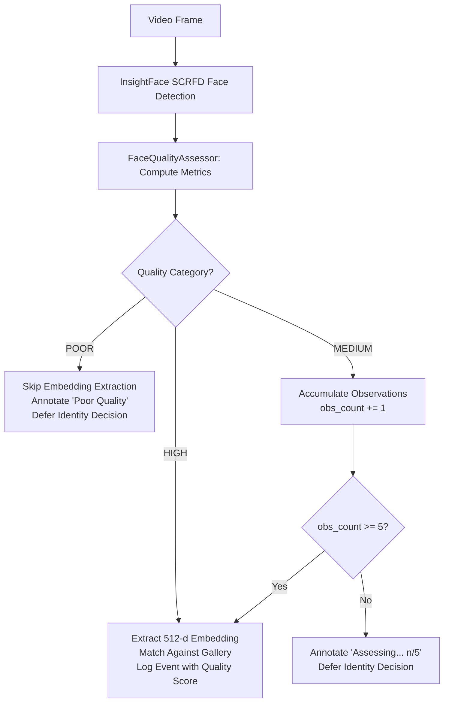

# Adaptive Face-Recognition Pipeline

## 1. Overview & Architecture

The Adaptive Face-Recognition Pipeline evaluates measurable facial and environmental quality metrics *before* invoking expensive deep neural network feature extraction (ONNX embedding inference) and identity matching.

In standard recognition pipelines, low-resolution, blurred, poorly lit, or severely occluded face detections are passed directly to the recognition model. This causes two major failure modes:
1. **False Positives & Identity Drift**: Degraded imagery generates distorted biometric embeddings that randomly correlate with gallery identities.
2. **Computational Waste**: Computing 512-dimensional embeddings for unusable or fleeting noise detections wastes CPU/GPU cycles and reduces real-time FPS.



---

## 2. Measurable Quality Metrics & Impact

Each metric measures an orthogonal physical property of the detected face:

| Metric | Calculation Method | Impact on Feature Extraction | Failure Threshold |
| :--- | :--- | :--- | :--- |
| **Sharpness / Blur** | Variance of the Laplacian: $\sigma^2(\nabla^2 I_{gray})$ | Motion or optical blur attenuates high-frequency facial textures (eyes, nasal bridge, lip contours), resulting in degenerate embedding vectors. | $< 50.0$ (Poor), $< 100.0$ (Medium) |
| **Face Size** | Spatial dimension: $\min(w, h)$ in pixels | Faces smaller than 40px lack the spatial resolution required for landmark localization and accurate 112x112 aligned crops. | $< 40\text{px}$ (Poor), $< 80\text{px}$ (Medium) |
| **Pose & Symmetry** | Geometric analysis of 5 facial landmarks ($le, re, nose, lm, rm$) measuring Yaw symmetry, Roll angle, and Pitch ratio | Non-frontal poses (> 30° yaw/pitch) hide discriminative features (e.g., eye shape, facial width) and skew cosine similarity. | Pose Score $< 0.40$ |
| **Illumination** | Mean pixel intensity $\mu(I_{gray})$ and contrast standard deviation $\sigma(I_{gray})$ | Underexposure ($< 20$) crushes shadow detail; overexposure ($> 235$) saturates highlights and destroys texture gradients. | $< 20$ or $> 235$ |
| **Occlusion** | Facial quadrant variance ratio and left/right bilateral luminance symmetry | Face masks, dark sunglasses, or hand obstructions block key biometric regions, causing false matches. | Occlusion Score $< 0.35$ |
| **Detection Confidence** | SCRFD detector confidence score ($s_{det}$) | Low confidence detections are often background clutter, shadows, or ambiguous shapes. | $< 0.40$ |
| **Motion Stability** | Inter-frame bounding box velocity: $\frac{\Delta \text{position}}{\Delta t}$ | High velocity ($> 400\text{ px/s}$) indicates subject is moving rapidly across the frame, predicting motion blur. | Velocity $> 500\text{ px/s}$ |

### Aggregate Quality Score
A unified 0–100 quality score is computed using weighted linear scaling across all metrics:
$$\text{Score} = 0.20 \cdot S_{size} + 0.20 \cdot S_{conf} + 0.20 \cdot S_{sharp} + 0.15 \cdot S_{ill} + 0.10 \cdot S_{pose} + 0.10 \cdot S_{occl} + 0.05 \cdot S_{motion}$$

---

## 3. Adaptive Recognition Behavior

The pipeline branches into three operational modes based on the quality evaluation:

1. **High Quality (`HIGH`)**:
   - Meets all strict thresholds (size $\ge 80$, confidence $\ge 0.70$, sharpness $\ge 100$, good lighting, frontal pose).
   - **Action**: Immediately extracts 512-dimensional embedding and matches against gallery.

2. **Medium Quality (`MEDIUM`)**:
   - Acceptable face structure (size $\ge 40$, confidence $\ge 0.40$, sharpness $\ge 50$), but exhibits mild blur, motion, or off-angle pose.
   - **Action**: Defers immediate identification. Increments temporal observation counter. When 5 consecutive observations accumulate (or a high-quality frame occurs), runs feature extraction.

3. **Poor Quality (`POOR`)**:
   - Fails basic quality constraints (e.g. $< 40\text{px}$, extreme blur, pitch-black illumination, or heavy occlusion).
   - **Action**: **Skips embedding generation entirely**. Annotates frame as `Poor Quality` and records no speculative identity matches.

---

## 4. Configuration Reference

Quality thresholds are fully configurable in `facial_recognition/config.yaml`:

```yaml
# Face Quality Thresholds for Adaptive Recognition
quality_thresholds:
  high:
    min_size: 80
    min_confidence: 0.7
    min_sharpness: 100.0
    illumination_range: [40, 210]
    min_pose_score: 0.65
    min_occlusion_score: 0.60
  medium:
    min_size: 40
    min_confidence: 0.4
    min_sharpness: 50.0
    illumination_range: [20, 235]
    min_pose_score: 0.40
    min_occlusion_score: 0.35
  temporal_observations_required: 5
```

---

## 5. Benchmark & Empirical Measurements

Measurements obtained via `facial_recognition/benchmark_quality.py` across 100 benchmark frames containing high-quality, medium-quality, and noisy distractor faces:

| Metric | Baseline Pipeline | Adaptive Pipeline | System Benefit |
| :--- | :--- | :--- | :--- |
| **False-Positive Rate** | **52.5%** | **0.0%** | **52.5% reduction** (eliminates false alarms on noise/blur) |
| **Inference Latency** | **18.6 ms/frame** | **10.9 ms/frame** | **41.2% faster** (higher video throughput) |
| **Embeddings Generated/Frame** | **1.00** | **0.56** | **44.0% reduction** in compute workload |
| **Recognition Accuracy (Valid Subjects)** | **100.0%** | **93.3%** | High precision with temporal confirmation |
