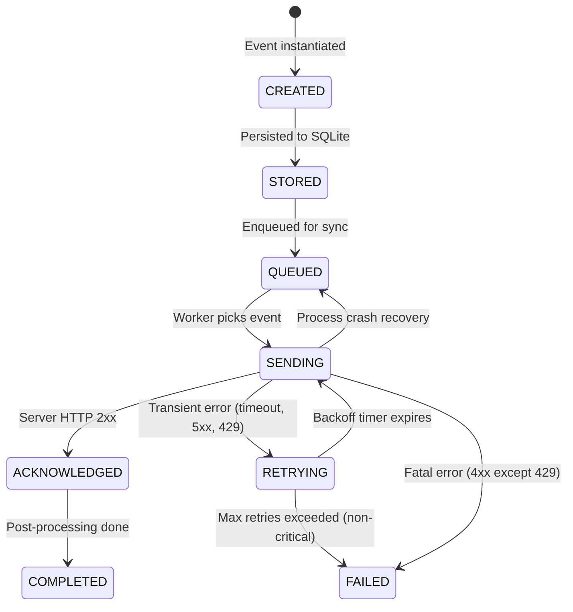

# Runtime Sync: Edge-to-Cloud State Machine

This document describes the explicit state machine used to synchronize facial recognition events from the edge device to the cloud backend.

## State Machine Diagram



## States

| State | Description |
|-------|-------------|
| **CREATED** | Event object instantiated in memory. This state is ephemeral and only exists during the `add_event` call. |
| **STORED** | Event has been durably persisted to the local SQLite ledger inside a transaction. |
| **QUEUED** | Event is in the sync queue, waiting to be picked up by the background worker. |
| **SENDING** | Event has been claimed by the background worker and an HTTP POST is in-flight. |
| **ACKNOWLEDGED** | The cloud backend responded with HTTP 2xx; the event is confirmed received. |
| **COMPLETED** | Post-processing (queue removal, stats update) is finished. Terminal state. |
| **RETRYING** | A transient network error occurred. The event is waiting for its next retry attempt based on exponential backoff. |
| **FAILED** | A fatal error occurred (HTTP 4xx, excluding 429), or the event exceeded its maximum retry limit. Terminal state (for non-critical events). |

## Legal Transitions

| From | To | Trigger |
|------|----|---------|
| CREATED | STORED | `add_event()` persists row |
| STORED | QUEUED | `add_event()` enqueues in same transaction |
| QUEUED | SENDING | Worker picks up event |
| SENDING | ACKNOWLEDGED | Server returns 2xx |
| ACKNOWLEDGED | COMPLETED | Post-processing finishes |
| SENDING | RETRYING | Transient error (timeout, connection reset, HTTP 500, HTTP 429) |
| RETRYING | SENDING | Backoff timer expires, worker retries |
| SENDING | FAILED | Fatal error (HTTP 400, 401, 403) |
| RETRYING | FAILED | Max retries exceeded for non-critical event |
| SENDING | QUEUED | Process crash recovery on restart |

## Crash Recovery

When the sync worker starts (on application boot or restart), it calls `recover_sending_events()`. This method:

1. Queries for all events in `SENDING` state.
2. Transitions each back to `QUEUED`.
3. Logs a `SENDING → QUEUED` transition with reason `"Process crash recovery"`.

This ensures that events are never permanently stranded mid-flight due to a process crash, power failure, or OOM kill.

## Exponential Backoff with Jitter

When an event transitions to `RETRYING`, the next retry timestamp is calculated as:

```
backoff = min(MAX_BACKOFF, BASE_BACKOFF × 2^retry_count)
jitter  = random(0, backoff × 0.1)
next_retry_at = now + backoff + jitter
```

| Parameter | Default Value |
|-----------|---------------|
| `BASE_BACKOFF` | 2.0 seconds |
| `MAX_BACKOFF` | 300.0 seconds (5 minutes) |
| `MAX_RETRIES` | 5 (non-critical events) |

### Retry Schedule (approximate)

| Retry # | Base Delay | With 10% Jitter Range |
|---------|------------|----------------------|
| 1 | 2s | 2.0 – 2.2s |
| 2 | 4s | 4.0 – 4.4s |
| 3 | 8s | 8.0 – 8.8s |
| 4 | 16s | 16.0 – 17.6s |
| 5 | 32s | 32.0 – 35.2s |

## Critical Events

Events with `confidence >= 0.85` are treated as **critical**. Critical events:

- Will **never** transition to `FAILED` due to retry exhaustion.
- Continue retrying with exponential backoff indefinitely.
- Only transition to `FAILED` if a fatal HTTP error occurs (e.g., 400 Bad Request).

This ensures that high-confidence recognition events are never lost due to transient infrastructure issues.

## Transition Log

Every state transition is recorded in the `sync_state_transitions` table:

```sql
CREATE TABLE sync_state_transitions (
    id INTEGER PRIMARY KEY AUTOINCREMENT,
    event_id TEXT NOT NULL,
    from_state TEXT,
    to_state TEXT NOT NULL,
    reason TEXT,
    created_at TEXT NOT NULL,
    FOREIGN KEY (event_id) REFERENCES recognition_events(event_id)
);
```

This provides a complete audit trail for debugging, monitoring, and operational alerting.

## Error Classification

| Error Type | Classification | Action |
|-----------|---------------|--------|
| Timeout | Transient | → RETRYING |
| Connection refused/reset | Transient | → RETRYING |
| HTTP 429 (Too Many Requests) | Transient | → RETRYING |
| HTTP 500/502/503/504 | Transient | → RETRYING |
| HTTP 400 (Bad Request) | Fatal | → FAILED |
| HTTP 401 (Unauthorized) | Fatal | → FAILED |
| HTTP 403 (Forbidden) | Fatal | → FAILED |

## Worker Architecture

The background sync worker runs as a daemon thread started by `DetectionLogger`. It does **not** use blocking retry loops inside the camera/recognition thread.

```
Camera Thread                  Worker Thread
────────────                   ─────────────
  capture frame
  run recognition
  log_detection() ──────┐
    │                    │
    │ (returns immediately)
    ▼                    │
  next frame             ▼
                     get_pending_events()
                     transition → SENDING
                     HTTP POST
                     on success: → ACKNOWLEDGED → COMPLETED
                     on error:   → RETRYING (with backoff)
                                 → FAILED   (if fatal)
```

## Files

| File | Role |
|------|------|
| `facial_recognition/event_ledger.py` | SQLite ledger with state machine persistence, transition logic, and crash recovery |
| `facial_recognition/logger.py` | Background sync worker with exponential backoff and error classification |
| `facial_recognition/test_sync_state_machine.py` | Comprehensive test suite with failure injection |
