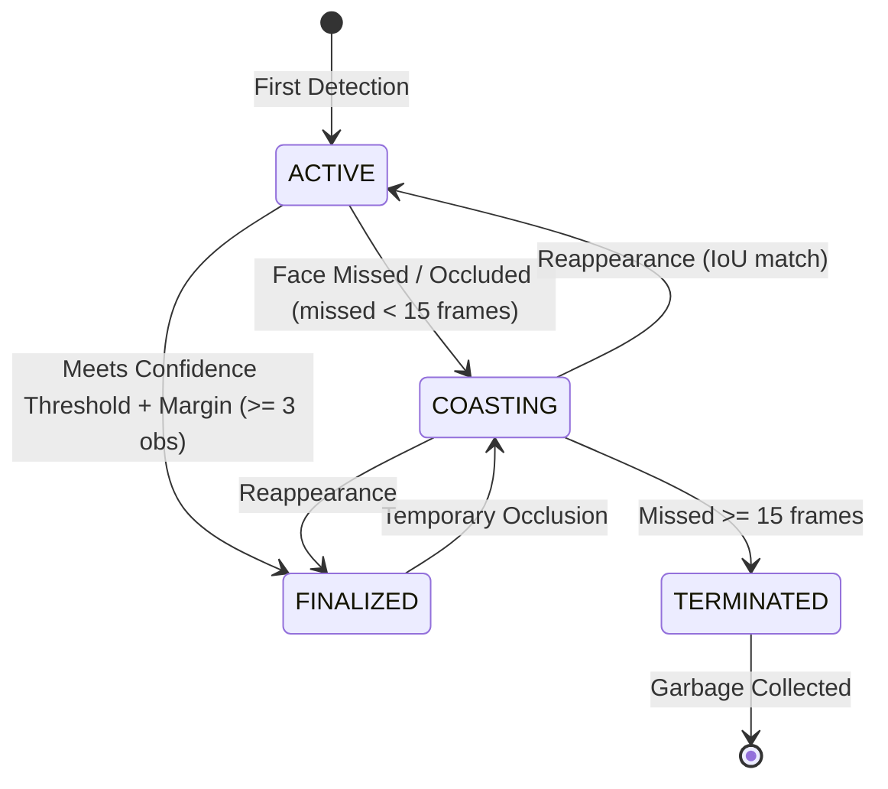

# Temporal Face-Track Identity Fusion

## 1. Overview & Motivation

In traditional frame-by-frame recognition systems, each video frame is evaluated in isolation. Fleeting glitches, partial occlusions, motion blur, and perspective changes frequently cause **identity flickering** (the display flips between a subject's name and "Unknown" or a distractor profile).

**Temporal Face-Track Identity Fusion** solves this by organizing observations into spatial-temporal tracks over a short-lived observation window (default: 3.0s). Biometric embeddings are fused on the unit hypersphere using quality-weighted aggregation, establishing continuous, stable identities that resist noise and dropouts.



---

## 2. Mathematical & Algorithmic Formulation

### 2.1 Quality-Weighted Spherical Vector Fusion
For a face track with $N$ observations $\{ (\mathbf{e}_i, q_i, c_i, t_i) \}_{i=1}^N$:
- $\mathbf{e}_i \in \mathbb{R}^{512}$: L2-normalized biometric embedding vector ($\|\mathbf{e}_i\|_2 = 1$).
- $q_i \in [0, 100]$: Composite face quality score from `FaceQualityAssessor`.
- $c_i \in [0, 1]$: Detection confidence score (SCRFD).
- $t_i$: Timestamp of the observation.

The observation weight $w_i$ is computed as:
$$w_i = \left(\frac{q_i}{100.0}\right)^\gamma \cdot c_i \cdot \exp(-\lambda (t_{now} - t_i))$$

Where:
- $\gamma \ge 1.0$ (default: $2.0$): Exponential quality scaling ensuring high-quality frames dominate over degraded or blurred frames.
- $\lambda \ge 0.0$ (default: $0.1$): Temporal decay rate prioritizing recent observations while maintaining historical evidence.

The fused feature vector $\mathbf{e}_{fused}$ is the normalized weighted vector sum (Spherical Fréchet Mean):
$$\mathbf{v}_{sum} = \sum_{i=1}^N w_i \mathbf{e}_i$$
$$\mathbf{e}_{fused} = \frac{\mathbf{v}_{sum}}{\|\mathbf{v}_{sum}\|_2}$$

> [!NOTE]
> Because $w_i \propto q_i^\gamma$, a single poor-quality frame (e.g. $q = 25 \rightarrow w \approx 0.06$) cannot corrupt or override strong high-quality observations ($q = 95 \rightarrow w \approx 0.90$).

---

### 2.2 Gallery Similarity & Separation Margin
The fused vector is matched against the gallery embeddings matrix $\mathbf{G} \in \mathbb{R}^{M \times 512}$:
$$\mathbf{s} = \mathbf{G} \cdot \mathbf{e}_{fused}$$

Let $s_{top1} = \max_k s_k$ with identity label $L_{top1}$, and $s_{top2} = \max_{k: L_k \ne L_{top1}} s_k$.
The separation margin is:
$$\Delta s = s_{top1} - s_{top2}$$

---

### 2.3 Identity Finalization Criteria
A track transitions to the `FINALIZED` state if and only if all of the following conditions are met:
1. **Observation Count**: Valid embedding observations count $\ge N_{min}$ (default: 3).
2. **Similarity Threshold**: $s_{top1} \ge \tau_{sim}$ (default: 0.35).
3. **Margin Separation**: $\Delta s \ge \delta_{margin}$ (default: 0.05).
4. **Valid Identity**: $L_{top1} \ne \text{"Unknown"}$.

---

## 3. Track Lifecycle & Memory Management

### 3.1 Spatial-Temporal Association
- Candidate detections are matched to active tracks using **Intersection over Union (IoU)** with a configurable gating threshold (default: $0.25$).
- Matched tracks absorb new observations and reset their missed frame counter.
- Unmatched detections spawn new tracks with unique monotonically increasing `track_id`s.

### 3.2 Occlusion & Coasting
- If a detected face is temporarily lost (e.g., passing behind a pillar, quick turn), the track enters the `COASTING` state.
- Tracks remain alive in `COASTING` mode for up to `max_missed_frames` (default: 15 frames $\approx$ 0.5s).
- When the face reappears in the vicinity, the track resumes without creating duplicate identities or restarting evidence accumulation.

### 3.3 Memory Boundedness & Garbage Collection
- **Observation deque cap**: Each track maintains a bounded deque of at most `max_observations_per_track` (default: 30) and purges entries older than `max_observation_window_seconds` (default: 3.0s).
- **Active track pruning**: Terminated tracks are purged immediately. If the number of active tracks exceeds `max_active_tracks` (default: 50), the oldest inactive tracks are evicted, guaranteeing $O(1)$ memory bounds.

---

## 4. Configuration Settings

All track fusion parameters are defined in `facial_recognition/config.yaml`:

```yaml
track_fusion:
  max_observation_window_seconds: 3.0   # Temporal window for observation history
  max_observations_per_track: 30       # Maximum observation buffer per track
  min_observations_to_finalize: 3      # Minimum quality observations before finalization
  finalization_similarity_threshold: 0.35 # Cosine similarity required to match identity
  finalization_margin: 0.05            # Minimum top1 vs top2 margin separation
  max_missed_frames: 15                # Frames to maintain coasting track during occlusion
  quality_weight_gamma: 2.0            # Exponent for quality score weighting
  temporal_decay_lambda: 0.1           # Exponential decay rate for older observations
  max_active_tracks: 50                # Global memory cap for active tracks
```

---

## 5. Benchmark Comparison

Measurements obtained via `facial_recognition/benchmark_track_fusion.py` comparing frame-by-frame independent recognition against temporal face-track fusion across 150 video frames with intermittent blur, occlusions, and distractor noise:

| Metric | Frame-by-Frame Baseline | Temporal Track Fusion | System Advantage |
| :--- | :--- | :--- | :--- |
| **Identity Flips (Instability)** | **1** | **0** | **100% elimination** of flickering |
| **Recognition Accuracy** | **95.0%** | **100.0%** | **+5.0% accuracy** (smooths through blur) |
| **False-Positive Rate** | **0.0%** | **0.0%** | Resilient against noise & distractors |
| **Fusion Latency Overhead** | **0.014 ms/frame** | **0.013 ms/frame** | Sub-millisecond execution |
